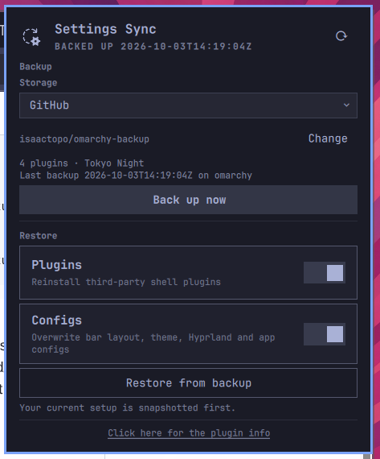

# Settings Sync — Omarchy backup & restore plugin

Backs up your Omarchy setup to a git repo (GitHub) and restores it on a fresh
install: third-party shell plugins (with git URLs + commits + enabled state),
bar layout (`shell.json`), theme, font, Hyprland config, menu, hooks,
terminals, starship/git/btop/lazygit, custom themes, and package lists.



## Layout

```
manifest.json          Omarchy shell plugin manifest (id: settings-sync)
Widget.qml             bar widget + popup panel (calls bin/settings-sync-ctl)
Model.js               status parsing / labels (QML + node-testable)
bin/settings-sync-ctl  the real backup/restore CLI (also used by the widget)
install.sh             links CLI to ~/.local/bin + installs/enables the plugin
```

The bar widget shows backup status; its panel has **Back up now** /
**Restore** buttons and the repo field. Everything the widget does is just
calling `settings-sync-ctl`, so terminal and UI never drift.

## Fresh install recovery

> GitHub login is required to reach a private backup repo — run
> `gh auth login` first, then the steps below.

```bash
# 1. Install this plugin (pick one):
omarchy plugin add https://github.com/isaactopo/omarchy-settings-sync.git --enable --yes
# ...or local/dev:
./install.sh

# 2. Restore everything from your backup repo:
settings-sync-ctl restore --repo git@github.com:you/omarchy-backup.git --yes

# 3. Optional: also reinstall the packages you had:
settings-sync-ctl restore --repo git@github.com:you/omarchy-backup.git --yes --with-packages
```

Restore snapshots whatever it is about to overwrite into
`~/.config/omarchy/settings-sync/backups/<timestamp>/`, reinstalls missing
third-party plugins via `omarchy plugin add <url> --enable`, re-applies
enabled/disabled states, pins plugins to the backed-up commit when possible,
sets theme/font, then rescans plugins and reloads the shell + Hyprland.

## Storage backends

GitHub is the default, but any of these hold the backup. Pick in the panel
picker or with `settings-sync-ctl init <backend> <target>`:

> Only GitHub is tested — the other backends are provided as-is and have
> not been verified in real use. Report what breaks.

| Backend | Target example | Needs |
|---|---|---|
| `github` | `https://github.com/you/omarchy-backup.git` | `gh auth login` |
| `git` (GitLab, Bitbucket, Codeberg, self-hosted…) | `git@gitlab.com:you/omarchy-backup.git` | your existing SSH key / credential setup |
| `local` (folder, USB stick) | `/run/media/you/STICK/omarchy-backup` | nothing — commits only, no push |
| `dropbox` | `~/Dropbox/omarchy-backup` | `omarchy install service dropbox` + tray login (the daemon syncs; no push) |
| `rclone` (Google Drive, OneDrive, Nextcloud, S3…) | `gdrive:omarchy-backup` | `rclone config` once (OAuth, like `gh auth login`) |

```bash
settings-sync-ctl init git git@gitlab.com:you/omarchy-backup.git
settings-sync-ctl init local /run/media/you/STICK/omarchy-backup
settings-sync-ctl init dropbox            # uses ~/Dropbox/omarchy-backup
settings-sync-ctl init rclone gdrive:omarchy-backup
settings-sync-ctl status                  # shows backend + availability
```

The plugin itself stays on GitHub (public) — `omarchy plugin add` needs a
git URL. Only the backup location varies.

Useful flags:

```bash
settings-sync-ctl status              # human-readable
settings-sync-ctl status --json       # what the widget reads
settings-sync-ctl backup --push -m "before experimenting"
settings-sync-ctl restore --skip-plugins   # configs only
settings-sync-ctl restore --skip-config    # plugins only
settings-sync-ctl list-plugins
```

## Removal

```bash
omarchy plugin remove settings-sync
rm -f ~/.local/bin/settings-sync-ctl   # only if installed via ./install.sh
# optional: rm -rf ~/.config/omarchy/settings-sync ~/.local/share/omarchy-settings-sync
```

## Dependencies

All standard on Omarchy, except where noted per storage backend:

- `bash`, `git`, `jq` — backup/restore engine
- `omarchy` CLI + `omarchy-shell` — plugin install, theme/font, shell IPC
- `gh` — only for the `github` backend (`gh auth login`)
- `rclone` — only for the `rclone` backend (`omarchy pkg add rclone`)
- `gum` — optional, prettier confirmations (plain `read` fallback otherwise)

## What gets backed up

| File in backup repo | Source |
|---|---|
| `backup.json`, `theme.txt`, `font.txt` | `omarchy theme/font current`, version |
| `plugins.json` | third-party plugins: id, git URL, commit, enabled |
| `shell.json` | `~/.config/omarchy/shell.json` |
| `hypr/` | `~/.config/hypr/*.lua`, `*.conf` |
| `omarchy/menu.jsonc` | `extensions/omarchy-menu.jsonc` |
| `omarchy/workspace-layout.json`, `shell.toml`, `hooks/` | `~/.config/omarchy/` (skips `*.sample`) |
| `terminals/` | alacritty, kitty, ghostty, foot |
| `starship.toml`, `gitconfig`, `btop/`, `lazygit/` | `~/.config/` |
| `themes-custom/` | `~/.config/omarchy/themes/*` |
| `packages.explicit`, `packages.aur` | `pacman -Qqe` / `-Qqm` (reference; installed only with `--with-packages`) |

## Notes

- Backups include `gitconfig` and possibly tokens — prefer private targets.
  (Per-file encryption via `git-crypt`/`age` is a possible follow-up.)
- Backup commits locally; only `--push` uploads (the widget's button pushes).
- Plugin restores never overwrite an already-installed plugin directory —
  delete `~/.config/omarchy/plugins/<id>` first if you want a clean re-clone.
- Package install is opt-in (`--with-packages`) and only fills in missing
  packages via `omarchy pkg add`.
- Validate before publishing: `omarchy plugin validate ~/Projects/omarchy-settings-sync`
